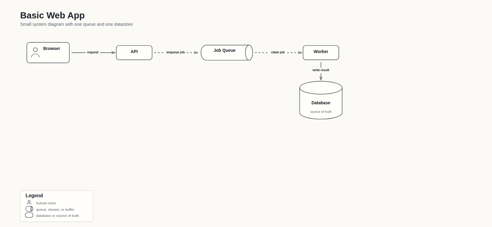
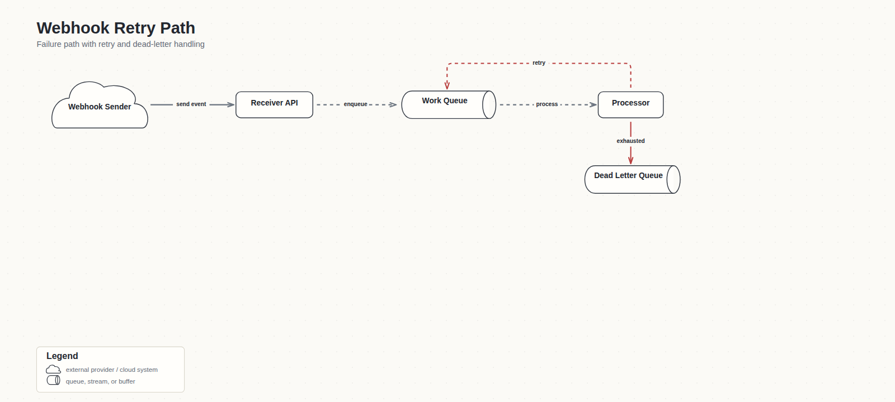
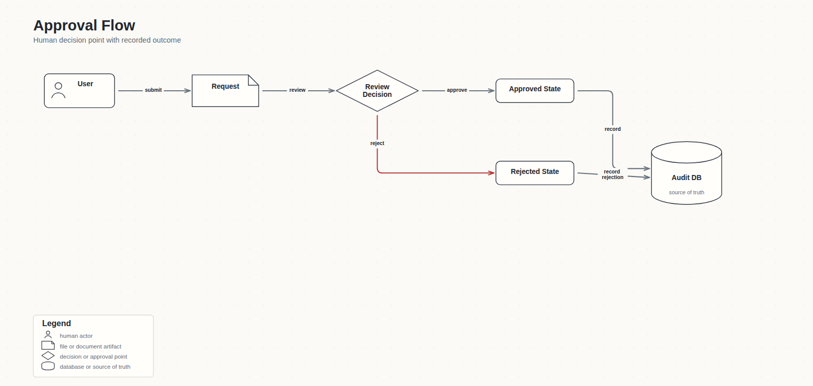

# Agent Skills

Reusable agent skills by Yann Cedric.

Small, practical workflows for coding agents. Copy or adapt them into any setup that supports skills, custom instructions, commands, prompts, or project guidance.

## Skills

### Grill Me Lite

`grill-me-lite` is a lightweight alignment mode for ambiguous product, UX, architecture, and implementation planning. It helps an agent inspect available evidence, ask one sharp question at a time, preserve durable decisions, and avoid building from fuzzy assumptions.

It is inspired by Matt Pocock's original [`grill-me`](https://github.com/mattpocock/skills/blob/main/skills/productivity/grill-me/SKILL.md) skill. Matt's version is intentionally tiny and sharp: interview relentlessly, walk the decision tree, ask one question at a time, give a recommended answer, and inspect the codebase before asking factual questions.

Use it for prompts like:

- "Grill me before we build this dashboard."
- "Stress test this API migration plan."
- "Think hard about this onboarding flow before making tasks."
- "Help me decide the first version of this feature."

This version adds product-building guardrails:

- product, UX, architecture, API, and task-planning triggers
- recommended defaults with consequences
- evidence-first questioning
- durable-decision capture by default when a ledger/log workflow is available
- a clear stopping rule
- a final shape for decisions, assumptions, tasks, gates, and open questions

See:

- [Skill file](skills/grill-me-lite/SKILL.md)
- [Usage examples](examples/grill-me-lite.md)

### Alignment Ledger

`alignment-ledger` keeps a lightweight decision artifact for product, UX, architecture, and strategy discussions that should survive beyond one conversation. It also defines how agents should find the existing ledger before creating a new one.

Use it for prompts like:

- "Start an alignment ledger for this redesign."
- "Capture the decisions from this planning session."
- "Update the project decision log before we build."
- "Prune this spec so only active assumptions remain."

It tracks:

- frame
- decisions
- assumptions
- open questions
- parked or rejected ideas
- readiness to build

It looks first for:

- a `Current alignment ledger:` pointer in root `HANDOFF.md`
- `docs/alignment-ledger.md`
- existing `docs/*alignment-ledger*.md`, `docs/*decision-log*.md`, or `docs/*design-state*.md` files

See:

- [Skill file](skills/alignment-ledger/SKILL.md)
- [Usage examples](examples/alignment-ledger.md)

### Execution Contract

`execution-contract` makes detached, delegated, background, scheduled, timed, and long-running agent work observable and honest. It separates execution state from reporting state, requires inspectable receipts before lifecycle claims, and fails closed when the runtime cannot provide durable supervision and delivery.

The skill evolved from repeated cases where work completed—or failed—after the parent conversation ended and no terminal result reached Telegram. It now includes:

- commit-before-acknowledgement ordering
- independent supervision and restart recovery requirements
- durable, idempotent terminal reporting
- separate conformance for delegated work and direct scheduled delivery
- concrete channel receipts instead of optimistic `delivered` flags
- OpenClaw-specific explorations, local probe evidence, and linked upstream issues

See:

- [Skill file](skills/execution-contract/SKILL.md)
- [Evolution, explorations, and known OpenClaw issues](skills/execution-contract/references/evolution-and-known-issues.md)
- [Adapter conformance suite](skills/execution-contract/references/conformance.md)

### Diagrammer

`diagrammer` creates deterministic technical diagrams as SVG/HTML with PNG exports. It is designed for architecture diagrams, system diagrams, data-flow diagrams, failure/retry paths, and other connector-heavy technical visuals where labels, arrows, shapes, and validation matter.

Prompt to image example:

> Create a system diagram for a small web app: browser, API, job queue, worker, and database.

More simple examples:

> Create a failure/retry diagram for webhook processing: receive event, validate it, enqueue work, retry failures, dead-letter exhausted jobs.

> Create an approval-flow diagram: user submits a request, reviewer approves or rejects it, and the system records the final state.

It includes:

- a concise agent workflow in `SKILL.md`
- a Python compiler package for layout/render/review
- compatibility scripts for compile/render/validate flows
- simple definition fixtures plus regression tests

See:

- [Skill file](skills/diagrammer/SKILL.md)
- [Usage examples](examples/diagrammer.md)

## Default Workflow

The skills stay installable separately, but they are designed to compose by default:

> Use `grill-me-lite` to clarify the plan. For durable project/product/architecture work, use `alignment-ledger` to find or update the decision artifact before moving into implementation.

This keeps public installation flexible while making the practical workflow one loop: question, remember, then build.

## Install

Use these skills wherever your agent can load reusable instructions:

- If your agent supports skill folders, copy the folder under `skills/` into that agent's skills directory.
- If your agent supports custom instructions, paste the relevant `SKILL.md` content into that system.
- If your agent has no skill system, use the examples as prompt templates or project guidance.

## License

MIT. See [LICENSE](LICENSE).

## Attribution

`grill-me-lite` is an original derivative workflow inspired by Matt Pocock's MIT-licensed `grill-me` skill. It is not affiliated with or endorsed by Matt Pocock.
