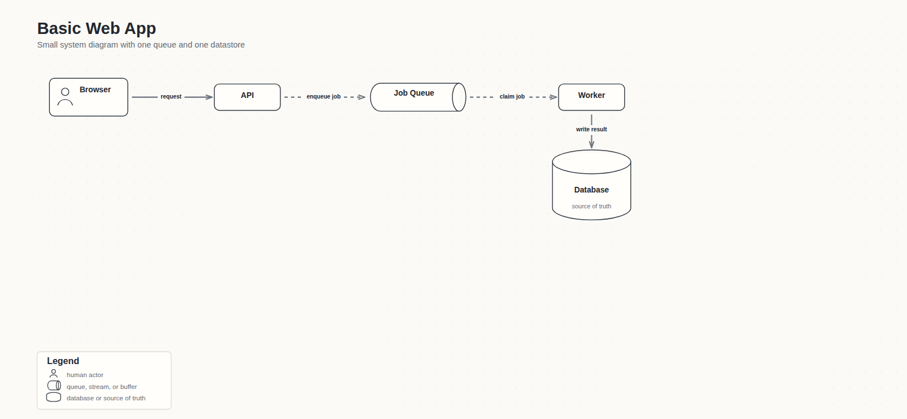
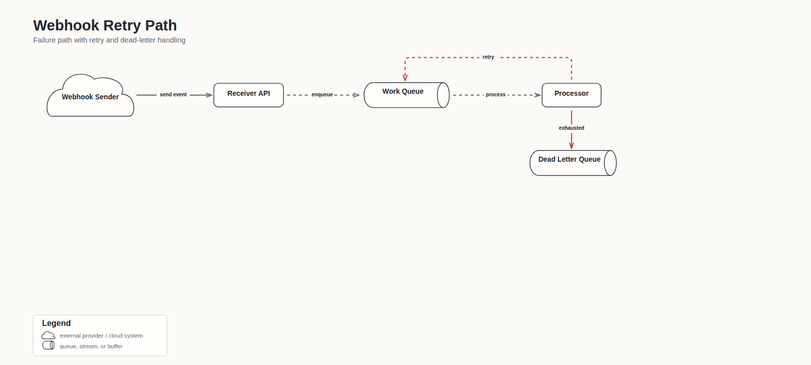
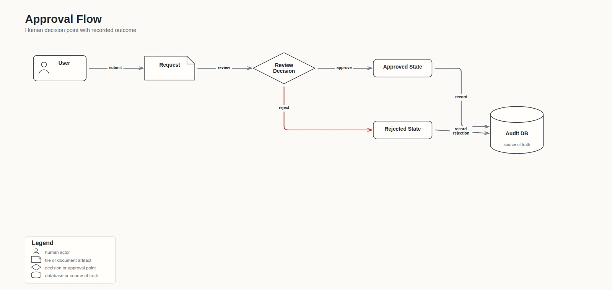

# Diagrammer Examples

Use `diagrammer` when the output needs a readable technical diagram, not just prose.

Simple prompts:

- "Create a system diagram for a small web app: browser, API, job queue, worker, database, and email provider."
- "Create a failure/retry diagram for webhook processing: receive event, validate it, enqueue work, retry failures, dead-letter exhausted jobs."
- "Create an approval-flow diagram: user submits a request, reviewer approves or rejects it, and the system records the final state."

## Example Outputs

### Basic Web App

Prompt:

> Create a system diagram for a small web app: browser, API, job queue, worker, and database.



### Webhook Retry Path

Prompt:

> Create a failure/retry diagram for webhook processing: receive event, validate it, enqueue work, retry failures, dead-letter exhausted jobs.



### Approval Flow

Prompt:

> Create an approval-flow diagram: user submits a request, reviewer approves or rejects it, and the system records the final state.



Good outputs should include:

- HTML/SVG source
- rendered PNG export
- concise assumptions and not-implied notes
- clean connector labels and arrowheads
- semantic shapes only when they clarify the system

Tiny definition example:

```json
{
  "title": "Small Web App",
  "template": "system-left-to-right",
  "nodes": [
    {"id": "browser", "label": "Browser", "kind": "client", "rank": 0, "lane": 0},
    {"id": "api", "label": "API", "kind": "api", "rank": 1, "lane": 0},
    {"id": "db", "label": "Database", "kind": "db", "rank": 2, "lane": 0}
  ],
  "edges": [
    {"from": "browser", "to": "api", "label": "request", "kind": "sync"},
    {"from": "api", "to": "db", "label": "read/write", "kind": "sync"}
  ]
}
```
